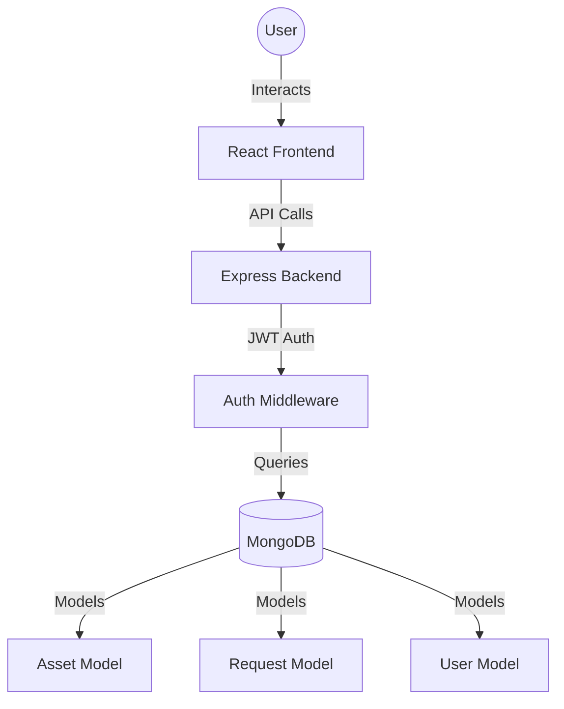

# TechVault - Asset Management System

TechVault is a modern, full-stack asset management system designed to streamline the process of tracking hardware, managing allocation requests, and maintaining an organized inventory.

## 🚀 What is TechVault?

TechVault serves as a central hub for organizations to manage their physical assets (laptops, monitors, mobile devices, etc.). It provides a clear interface for:
- **Employees** to request new hardware and track their assigned assets.
- **Administrators** to review requests, manage inventory, and monitor asset health.

## 🛠 How It Works

The system is built with a robust client-server architecture, ensuring scalability, security, and a premium user experience.

### Technical Stack
- **Frontend**: React (Vite) with TypeScript, Material UI for a polished design, and Zustand for state management.
- **Backend**: Node.js with Express and TypeScript.
- **Database**: MongoDB with Mongoose ODM for flexible data modeling.
- **Authentication**: JWT-based authentication with secure cookie storage.

### Core Modules

#### 1. Asset Management (`/server/src/models/Asset.ts`)
Tracks individual hardware items.
- **Attributes**: Name, Serial Number, Type, Status (Available, Assigned, Maintenance).
- **Relationships**: Linked to a `User` when assigned.

#### 2. Request System (`/server/src/models/Request.ts`)
Standardizes the workflow for obtaining new equipment.
- **Flow**: Employee submits a request -> Status is `Pending` -> Administrator `Approves` or `Rejects`.
- **Validation**: Ensures requests are tied to specific asset types and valid user accounts.

#### 3. User & Authentication (`/server/src/models/User.ts`)
Handles identity and access control.
- **Roles**: Distinct roles (e.g., Administrator, Employee) determine available actions in the UI.

## 🏁 Getting Started

### Prerequisites
- Node.js (v16+)
- MongoDB instance (local or Atlas)

### Local Setup

1. **Clone the repository**:
   ```bash
   git clone <repository-url>
   cd TechVault
   ```

2. **Backend Setup**:
   ```bash
   cd server
   npm install
   # Create a .env file based on .env.example
   npm run seed # Populate the database with test users
   npm run dev
   ```

3. **Frontend Setup**:
   ```bash
   cd client
   npm install
   npm run dev
   ```

## 🔑 Test Credentials

Use these credentials to test the different roles:

| Role | Email | Password |
| :--- | :--- | :--- |
| **Admin** | `admin@techvault.com` | `admin123` |
| **Employee** | `john@techvault.com` | `user123` |

## 🏗 Architecture Overview



## ✨ Key Features
- **Glassmorphic UI**: A premium, modern interface with smooth transitions.
- **Real-time Status Updates**: Instant feedback on asset allocation.
- **Secure Architecture**: Protected routes and sanitized API endpoints.
